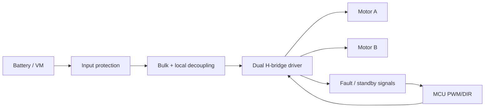

# Custom PCB Motor Driver

[](https://github.com/vasu4990/custom-pcb-motor-driver/actions/workflows/checks.yml)

An engineering design package for a compact low-voltage dual DC-motor driver board intended for mobile robotics prototypes.

> **Status:** design/reference package complete; the PCB itself is **not claimed as fabricated or electrically validated**. Final component values, copper widths, thermal performance, and protection behavior must be verified against the selected motor driver IC, battery, motors, and PCB stack-up before fabrication.

## What this repository contains

- Electrical design requirements and assumptions
- Functional architecture and interface definition
- Starter BOM
- Design-value manifest
- Current/power-loss estimation utility
- Board-review checklist
- Bring-up and validation procedure
- CI checks for repository consistency and utility tests

## Intended operating envelope

This project targets small battery-powered robots rather than high-power motor systems. The default reference envelope is:

- Motor supply: 6–12 V nominal
- Two brushed DC motor channels
- Logic interface: 3.3 V / 5 V compatible where supported by the chosen driver
- PWM + direction control
- Bulk and local decoupling
- Reverse-polarity / transient protection as design options

These are **design targets**, not measured specifications.

## Architecture



See [`docs/ARCHITECTURE.md`](docs/ARCHITECTURE.md) and [`docs/DESIGN_SPEC.md`](docs/DESIGN_SPEC.md).

## Repository layout

```text
.
├── docs/
│   ├── ARCHITECTURE.md
│   ├── BRINGUP.md
│   ├── DESIGN_REVIEW_CHECKLIST.md
│   └── DESIGN_SPEC.md
├── hardware/
│   ├── BOM.csv
│   └── design_values.yaml
├── tools/
│   └── current_estimator.py
├── tests/
│   └── test_current_estimator.py
└── .github/workflows/checks.yml
```

## Quick engineering check

```bash
python tools/current_estimator.py --current 1.2 --rds-on 0.25 --channels 2
pytest -q
```

The estimator is intentionally simple: it helps sanity-check conduction losses and expected heat, but it is not a replacement for the selected IC's datasheet thermal model.

## Before fabrication

1. Select the exact motor-driver IC and package.
2. Confirm absolute maximum and recommended operating values from its datasheet.
3. Measure or obtain motor stall current.
4. Size traces, connectors, vias, and copper for expected continuous and peak current.
5. Verify decoupling placement and thermal pad/via recommendations.
6. Run ERC/DRC in the PCB CAD tool.
7. Review polarity, pin-1 orientation, footprints, connector order, and mounting holes.
8. Generate Gerbers only after the design-review checklist is complete.

## After fabrication

Follow [`docs/BRINGUP.md`](docs/BRINGUP.md): resistance checks first, then current-limited power-up without motors, logic validation, one motor at low duty cycle, and finally load/thermal testing.

## License

MIT — see [`LICENSE`](LICENSE). Hardware documentation is provided without warranty; verify all electrical assumptions before use.
