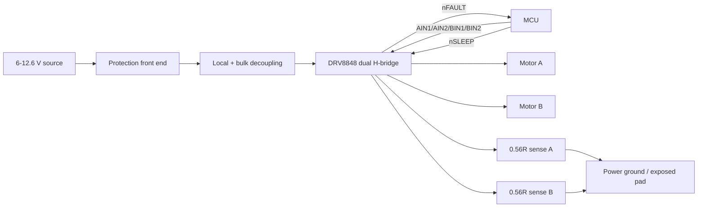

# Architecture

## Layers of responsibility

**Source/protection:** connector, fuse, polarity protection, transient clamp and optional input bulk capacitor.

**Power stage:** DRV8848, local VM decoupling, VINT bypass, exposed pad/thermal copper, motor connectors and sense resistors.

**Control:** four bridge inputs, nSLEEP, nFAULT and VREF.

**Verification:** machine-readable netlist contract, test points, calculation scripts, BOM linter, release-state gate and documented first-article test sequence.

The design intentionally keeps source-specific protection separate from the core driver because a bench supply, 2S/3S battery and long robot harness can require materially different surge and fuse decisions.
