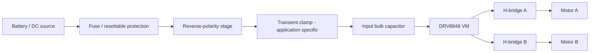

# Electrical Design

## Design objective

Two-channel brushed-DC motor control for small mobile robots from a 6–12.6 V source, with deterministic current limiting, MCU fault visibility, safe sleep behavior, local decoupling, and an explicit protection front end.

## Power path



Protection part numbers remain intentionally application-specific because the correct fuse, TVS, reverse-polarity MOSFET, and bulk capacitor depend on the real battery, harness inductance, connector, and motor stall/regeneration behavior.

## Current regulation

The reference design ties `VREF` to `VINT` and uses **0.56 Ω / 1 W / 1%** sense resistors on AISEN and BISEN. The datasheet relation is:

```text
IFS = VREF / (6.6 × RISENSE)
```

That gives about 0.893 A nominal full-scale chopping current. The automated design model also checks VINT tolerance and resistor tolerance rather than only the nominal equation.

## Decoupling

The reference design uses:

- 0.1 µF high-frequency ceramic at VM
- 22 µF / 25 V local ceramic at VM (greater than the datasheet 10 µF minimum)
- optional 220 µF / 25 V low-ESR input bulk capacitor depending on harness/source impedance
- 2.2 µF ceramic at VINT

High-value MLCC effective capacitance can drop under DC bias, so the exact package/dielectric must be checked before fabrication.

## Logic interface

The MCU interface exposes `AIN1`, `AIN2`, `BIN1`, `BIN2`, `nSLEEP`, `nFAULT`, `VREF`, `GND`, and `VLOGIC`. `nFAULT` is open-drain and is pulled up with a reference 10 kΩ resistor. `nSLEEP` is the system-level safe enable and must remain low until the controller is initialized.

## Protection philosophy

1. **Normal current control:** xISEN/VREF chopping regulator.
2. **Semiconductor protection:** internal OCP, UVLO, thermal shutdown and short-circuit response.
3. **Board/source protection:** fuse, reverse-polarity stage and TVS selected for the final source/harness.
4. **System safety:** firmware holds nSLEEP low during reset, fault, and brownout handling.
